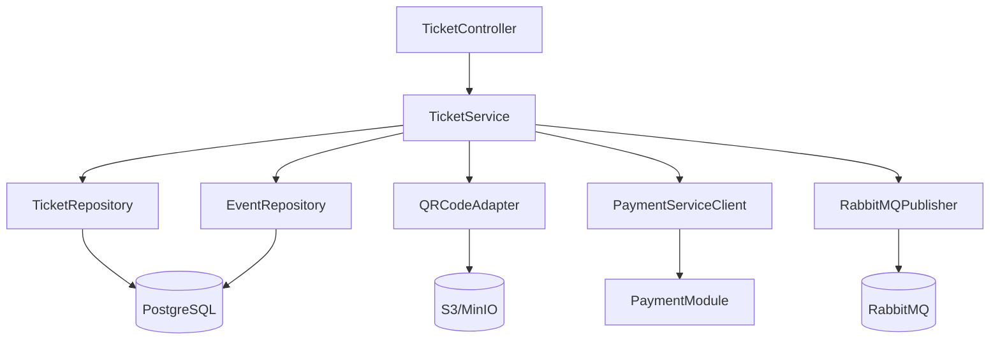
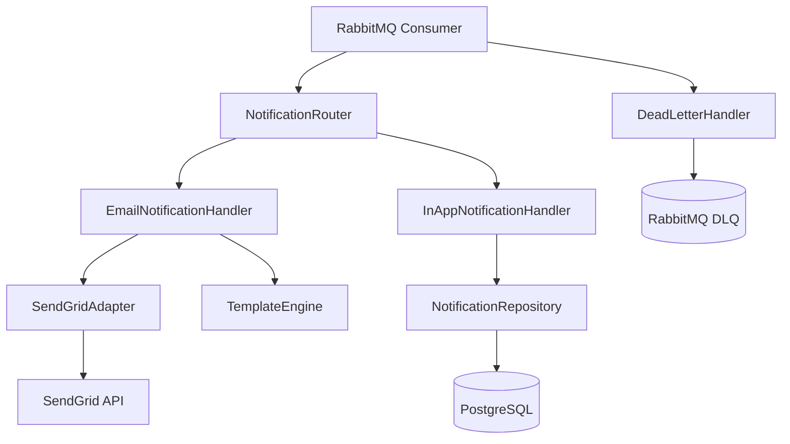
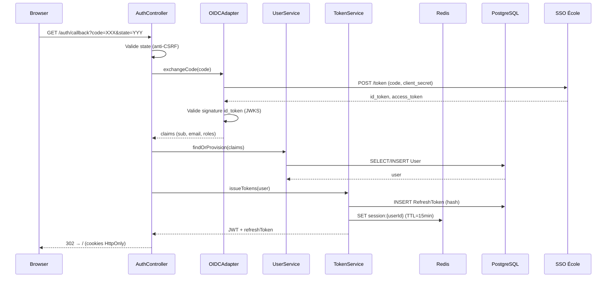

# §7 — Conception détaillée par module

Les trois modules retenus couvrent une diversité technique maximale : **TicketModule** (module métier complexe avec concurrence), **NotificationModule** (orchestration asynchrone), **AuthModule** (dimension transverse et sécurité). Chaque fiche respecte la structure en six rubriques imposée.

---

## §7.1 — TicketModule

### Responsabilité

Le TicketModule gère l'allocation concurrente de places sur jauge limitée et pilote l'intégralité du cycle de vie d'un ticket, de la réservation initiale jusqu'à l'utilisation ou l'annulation.

---

### Contrat d'interface

**Endpoints REST exposés :**

| Méthode | Chemin | Codes retour |
|---|---|---|
| POST | `/api/v1/tickets` | 201, 400, 409, 422 |
| GET | `/api/v1/tickets/{id}` | 200, 403, 404 |
| GET | `/api/v1/users/me/tickets` | 200, 401 |
| DELETE | `/api/v1/tickets/{id}` | 200, 403, 404, 409 |
| POST | `/api/v1/events/{id}/waitlist` | 201, 409, 422 |
| DELETE | `/api/v1/events/{id}/waitlist` | 204, 404 |

**Événements publiés sur RabbitMQ :**

- `ticket.confirmed` → topic `tickets.events.v1` — publié après confirmation (paiement capturé ou événement gratuit)
- `ticket.cancelled` → topic `tickets.events.v1` — publié après annulation d'un ticket confirmé

**Événements consommés depuis RabbitMQ :**

- `payment.failed` (topic `payments.events.v1`) → remet le ticket en `pending` ou `cancelled`, libère la place
- `event.cancelled` (topic `events.events.v1`) → annule tous les tickets confirmés de l'événement, déclenche les remboursements

**Appels sortants :**

- PaymentService (interne, HTTP) — initiation du PaymentIntent lors de la création d'un ticket payant
- S3/MinIO (HTTPS, AWS SDK) — stockage du QR code généré au format PNG

---

### Architecture interne



Le TicketController reçoit les requêtes HTTP et délègue immédiatement au TicketService, qui porte toute la logique métier. Le TicketRepository encapsule les accès PostgreSQL, notamment le verrou pessimiste sur la jauge. Le QRCodeAdapter génère le QR code et le pousse sur S3. Le RabbitMQPublisher publie les événements de cycle de vie.

---

### Algorithme critique : allocation concurrente sur jauge limitée

```
FUNCTION reserveTicket(userId, eventId):

  BEGIN TRANSACTION ISOLATION LEVEL SERIALIZABLE

    -- Verrou pessimiste : SELECT FOR UPDATE sur la ligne Event
    event = SELECT * FROM events WHERE id = eventId FOR UPDATE

    IF event.status != 'published' THEN
      ROLLBACK
      RAISE 422 UnprocessableEntity("event_not_open")

    IF event.tickets_sold >= event.capacity THEN
      ROLLBACK
      RAISE 422 UnprocessableEntity("event_full")

    -- Vérification double inscription
    existing = SELECT * FROM tickets
               WHERE user_id = userId AND event_id = eventId
               AND status NOT IN ('cancelled', 'refunded')

    IF existing IS NOT NULL THEN
      ROLLBACK
      RAISE 409 Conflict("ticket_already_exists")

    -- Création atomique du ticket
    ticket = INSERT INTO tickets (user_id, event_id, status)
             VALUES (userId, eventId, 'pending')

    -- Décrément de la jauge dans la même transaction
    UPDATE events SET tickets_sold = tickets_sold + 1
    WHERE id = eventId

  COMMIT

  -- Hors transaction : initiation du paiement si nécessaire
  IF event.price > 0 THEN
    paymentIntent = PaymentService.initiate(ticket.id, event.price)
    RETURN ticket, paymentIntent.client_secret
  ELSE
    ticket.status = 'confirmed'
    ticket.confirmed_at = now()
    SAVE ticket
    RabbitMQ.publish('ticket.confirmed', buildPayload(ticket))
    RETURN ticket
```

**Décision documentée :** verrou pessimiste `SELECT FOR UPDATE` retenu plutôt que verrou optimiste avec retry, car le risque de contention sur la dernière place est élevé lors des ouvertures de billetterie (pics de trafic simultané). Le coût en performance est acceptable au regard de la garantie d'intégrité. Voir ADR-002.

---

### Gestion des erreurs

| Code interne | Cause | Comportement | Code HTTP |
|---|---|---|---|
| `TICKET_ALREADY_EXISTS` | L'utilisateur possède déjà un ticket actif pour cet événement (contrainte UNIQUE) | Rollback, retour RFC 7807 | 409 Conflict |
| `EVENT_FULL` | `tickets_sold >= capacity` au moment du verrou | Rollback, proposition liste d'attente | 422 Unprocessable |
| `EVENT_NOT_OPEN` | Statut de l'événement != `published` | Rollback immédiat | 422 Unprocessable |
| `PAYMENT_SERVICE_UNAVAILABLE` | PaymentService timeout ou erreur 5xx | Ticket reste en `pending`, retry automatique via job planifié | 502 Bad Gateway |
| `CANCELLATION_WINDOW_EXPIRED` | Annulation demandée hors délai (> 48h avant l'événement) | Rejet de la demande | 409 Conflict |
| `QR_GENERATION_FAILED` | Erreur S3 lors du stockage du QR code | Log + retry 3x, ticket confirmé sans QR (envoi différé) | 200 (dégradé) |

---

### Cas limites

**Cas limite : double-clic sur "S'inscrire"**
L'utilisateur clique deux fois rapidement sur le bouton d'inscription, générant deux requêtes POST quasi-simultanées.
Décision retenue : la contrainte UNIQUE(user_id, event_id) en base garantit que la seconde requête échoue avec un 409. La transaction la plus lente sera rollbackée. Côté front, le bouton doit être désactivé après le premier clic, mais la protection base est la seule garantie fiable.

**Cas limite : annulation après paiement capturé**
L'utilisateur annule un ticket dont le paiement est déjà au statut `succeeded` côté Stripe.
Décision retenue : le TicketModule publie un événement `ticket.cancelled` avec le flag `requires_refund: true`. Le PaymentModule consomme cet événement et initie le remboursement via l'API Stripe Refunds. Le ticket passe en `cancelled` immédiatement, le remboursement est asynchrone. L'utilisateur reçoit une notification de confirmation du remboursement à réception du webhook Stripe `charge.refunded`.

**Cas limite : dernière place prise pendant le traitement du paiement**
Le ticket est créé en `pending` et la place décrementée, mais le paiement échoue. La place est donc bloquée pendant la durée du PaymentIntent (30 min).
Décision retenue : un job planifié toutes les 15 minutes annule les tickets en `pending` depuis plus de 30 minutes et incrémente à nouveau `tickets_sold`. La liste d'attente est notifiée en conséquence.

#### Décisions structurantes
- Voir ADR-002 sur la stratégie de gestion de la concurrence (verrou pessimiste)

---

## §7.2 — NotificationModule

### Responsabilité

Le NotificationModule délivre les notifications multi-canal (email via SendGrid et in-app) aux utilisateurs en réponse aux événements asynchrones de la plateforme, en garantissant la traçabilité et la résilience des envois.

---

### Contrat d'interface

**Endpoints REST exposés :**

| Méthode | Chemin | Codes retour |
|---|---|---|
| GET | `/api/v1/users/me/notifications` | 200, 401 |
| PATCH | `/api/v1/users/me/notifications/{id}/read` | 200, 403, 404 |

**Événements publiés sur RabbitMQ :** aucun (consommateur pur).

**Événements consommés depuis RabbitMQ :**

- `ticket.confirmed` (topic `tickets.events.v1`) → envoie email de confirmation + crée notification in-app
- `payment.failed` (topic `payments.events.v1`) → envoie email d'échec de paiement + notification in-app
- `event.cancelled` (topic `events.events.v1`) → envoie email d'annulation à tous les détenteurs de tickets

**Appels sortants :**

- SendGrid (HTTPS, API REST) — envoi des emails transactionnels via templates dynamiques
- PostgreSQL (interne) — persistance des notifications in-app dans la table `Notification`

---

### Architecture interne



Le RabbitMQ Consumer écoute les topics configurés et délègue chaque message au NotificationRouter, qui sélectionne les handlers appropriés selon le type d'événement. Le EmailNotificationHandler utilise le TemplateEngine pour composer le contenu et le SendGridAdapter pour l'envoi. L'InAppNotificationHandler persiste la notification en base. Le DeadLetterHandler capture les messages ayant épuisé leurs tentatives de retry.

---

### Algorithme critique : stratégie de retry et bascule DLQ

```
FUNCTION handleNotificationEvent(message):

  attempt = message.headers['x-death']?.count ?? 0

  TRY:
    notification = NotificationRouter.route(message)

    IF notification.channel == 'email':
      result = SendGridAdapter.send(notification)

      IF result.status == 'queued' OR result.status == 'sent':
        InAppNotificationHandler.persist(notification)
        message.ack()
        RETURN

      ELSE:
        RAISE SendGridError(result.error)

    ELSE IF notification.channel == 'in_app':
      NotificationRepository.save(notification)
      message.ack()
      RETURN

  CATCH SendGridError AS e:
    IF attempt < 4:
      delay = 2^attempt * 2  -- backoff exponentiel : 2s, 4s, 8s, 16s
      message.nack(requeue=false)
      -- RabbitMQ republiera via x-dead-letter-exchange avec TTL
      LOG.warn("SendGrid failed, attempt={}, retry in {}s", attempt, delay)
    ELSE:
      -- Épuisement des tentatives
      DeadLetterHandler.route(message)
      LOG.error("Notification permanently failed, sent to DLQ", message.id)
      message.ack()  -- on acquitte pour ne pas bloquer le consumer

  CATCH UserNotFoundError:
    -- Utilisateur supprimé entre la publication et le traitement
    LOG.info("User not found, skipping notification", message.userId)
    message.ack()  -- skip silencieux

  CATCH InvalidEmailError:
    -- Email invalide ou bounced
    LOG.warn("Invalid email, skipping", message.userId)
    message.ack()  -- skip silencieux, pas de retry
```

---

### Gestion des erreurs

| Code interne | Cause | Comportement | Code HTTP |
|---|---|---|---|
| `SENDGRID_UNAVAILABLE` | SendGrid timeout ou erreur 5xx | Retry exponentiel x4, puis DLQ | 502 (log interne) |
| `INVALID_EMAIL` | Adresse email invalide ou bounced (code Sendgrid 550) | Skip + log, pas de retry | — (asynchrone) |
| `TEMPLATE_NOT_FOUND` | Template SendGrid manquant pour le type d'événement | Log erreur critique + DLQ immédiat | — (asynchrone) |
| `NOTIFICATION_NOT_FOUND` | Notification in-app inexistante lors du marquage lu | Retour 404 | 404 Not Found |
| `FORBIDDEN_NOTIFICATION` | Tentative de marquer la notification d'un autre utilisateur | Retour 403 | 403 Forbidden |

---

### Cas limites

**Cas limite : SendGrid indisponible pendant une vague d'annulations d'événement**
Un événement populaire est annulé, déclenchant des centaines d'événements `event.cancelled` simultanés. SendGrid est temporairement dégradé.
Décision retenue : le retry exponentiel absorbe les pics courts. Pour les indisponibilités longues, les messages restent dans la queue RabbitMQ (durables) jusqu'à 24h. Au-delà, ils basculent en DLQ et une alerte est déclenchée pour traitement manuel. Les notifications in-app sont persistées indépendamment des emails et ne sont pas affectées.

**Cas limite : utilisateur sans email valide**
Un utilisateur s'est inscrit via SSO sans email vérifié, ou son email a été supprimé (exercice du droit à l'oubli partiel).
Décision retenue : le handler vérifie la présence d'un email valide avant l'appel SendGrid. En l'absence d'email, la notification in-app est créée normalement, l'email est skippé avec un log `INFO` (pas d'erreur). Aucun retry n'est tenté.

#### Décisions structurantes
- Voir ADR-003 sur la politique de retry et DLQ des événements asynchrones

---

## §7.3 — AuthModule

### Responsabilité

L'AuthModule orchestre l'authentification des utilisateurs via le SSO école (OIDC), émet et valide les tokens JWT applicatifs, et propage le contexte d'identité (userId, rôle) à l'ensemble des modules de la plateforme.

---

### Contrat d'interface

**Endpoints REST exposés :**

| Méthode | Chemin | Codes retour |
|---|---|---|
| GET | `/api/v1/auth/callback` | 302, 400, 401, 500 |
| POST | `/api/v1/auth/refresh` | 200, 401, 403 |
| POST | `/api/v1/auth/logout` | 204, 401 |

**Événements publiés sur RabbitMQ :** aucun.

**Événements consommés depuis RabbitMQ :** aucun.

**Appels sortants :**

- SSO École (HTTPS, OpenID Connect) — échange du code d'autorisation contre les tokens OIDC, validation du `state`, récupération du `id_token`
- PostgreSQL (interne) — lecture/écriture des entités User et RefreshToken
- Redis (interne, via client Redis) — stockage des sessions actives et des clés d'idempotence de refresh

---

### Architecture interne



---

### Algorithme critique : flow OIDC complet avec provisioning

```
FUNCTION handleOIDCCallback(code, state, sessionState):

  -- 1. Validation anti-CSRF
  IF state != sessionState THEN
    RAISE 400 BadRequest("invalid_state")

  -- 2. Échange du code contre les tokens OIDC
  TRY:
    oidcTokens = SSO.exchangeCode(code, redirectUri, clientSecret)
  CATCH OIDCError:
    RAISE 401 Unauthorized("oidc_exchange_failed")

  -- 3. Validation du id_token (signature + expiration + audience)
  claims = JWKS.validate(oidcTokens.id_token, expectedAudience)
  IF claims IS NULL THEN
    RAISE 401 Unauthorized("invalid_id_token")

  -- 4. Provisioning de l'utilisateur (find or create)
  user = UserRepository.findByEmail(claims.email)
  IF user IS NULL THEN
    -- Premier login : création automatique du compte
    user = UserRepository.create({
      email: claims.email,
      first_name: claims.given_name,
      last_name: claims.family_name,
      is_active: true
    })

  IF NOT user.is_active THEN
    RAISE 403 Forbidden("account_disabled")

  -- 5. Détermination du rôle applicatif
  role = mapOIDCRoleToAppRole(claims.groups)
  -- SSO renvoie les groupes école → mapping vers student/organizer/admin

  -- 6. Émission des tokens applicatifs
  jwt = JWT.sign({
    sub: user.id,
    email: user.email,
    role: role,
    exp: now() + 15min
  }, privateKey)

  refreshTokenRaw = crypto.randomBytes(64)
  refreshTokenHash = SHA256(refreshTokenRaw + salt)
  RefreshTokenRepository.save({
    user_id: user.id,
    token_hash: refreshTokenHash,
    expires_at: now() + 30days
  })

  Redis.set("session:" + user.id, jwt, TTL=15min)

  RETURN jwt, refreshTokenRaw  -- refreshToken envoyé en cookie HttpOnly
```

---

### Gestion des erreurs

| Code interne | Cause | Comportement | Code HTTP |
|---|---|---|---|
| `INVALID_STATE` | Paramètre `state` du callback ne correspond pas à la session | Rejet immédiat, log sécurité | 400 Bad Request |
| `OIDC_EXCHANGE_FAILED` | SSO école indisponible ou code expiré | Redirection vers page d'erreur | 401 Unauthorized |
| `INVALID_ID_TOKEN` | Signature JWKS invalide ou token expiré | Rejet, log sécurité | 401 Unauthorized |
| `ACCOUNT_DISABLED` | Compte utilisateur désactivé par un admin | Rejet avec message explicite | 403 Forbidden |
| `REFRESH_TOKEN_INVALID` | Token inconnu, révoqué ou expiré | Rejet, forcer re-login | 401 Unauthorized |
| `REFRESH_TOKEN_REUSE` | Refresh token déjà utilisé (détection de vol) | Révocation de tous les tokens de la session | 403 Forbidden |

---

### Cas limites

**Cas limite : token JWT révoqué côté SSO mais encore valide localement**
L'administrateur école révoque l'accès d'un étudiant dans le SSO, mais le JWT applicatif (15 min de durée de vie) est encore valide côté SupEvents.
Décision retenue : durée de vie du JWT volontairement courte (15 min) pour limiter la fenêtre d'exposition. À chaque refresh, le RefreshToken est vérifié en base — s'il est révoqué, la session est terminée. Pour les cas urgents (exclusion immédiate), un admin peut invalider manuellement la session via Redis (`DEL session:{userId}`).

**Cas limite : premier login d'un utilisateur inconnu du SSO école**
Un utilisateur se connecte pour la première fois — il n'existe pas encore dans la base SupEvents.
Décision retenue : provisioning automatique à la réception des claims OIDC (`find or create`). Le compte est créé avec le rôle `student` par défaut. Le passage au rôle `organizer` nécessite une demande explicite validée par un admin (voir UserModule). Aucune donnée saisie manuelle n'est requise au premier login.

#### Décisions structurantes
- Voir ADR-001 sur le choix du pattern d'authentification (JWT stateless vs sessions Redis)
