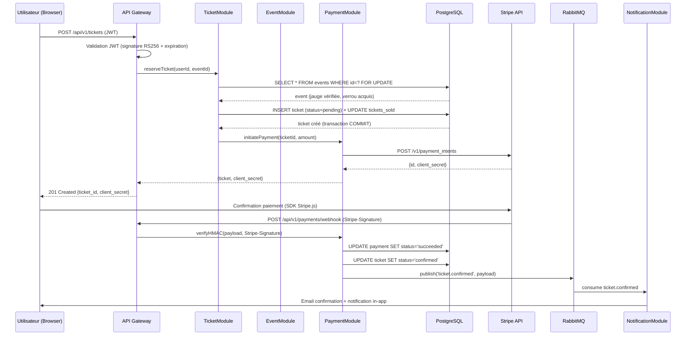
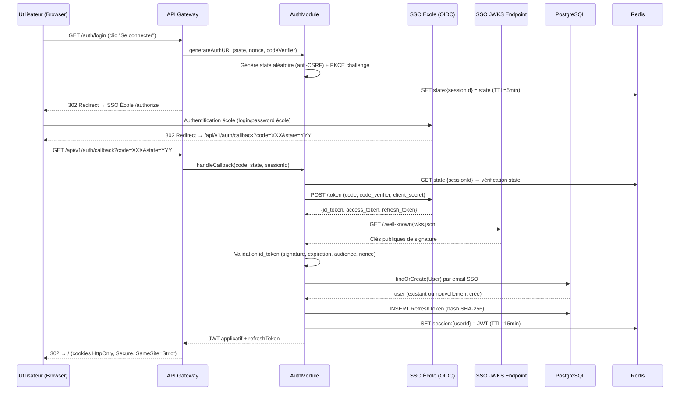

# §9 — Exigences transverses

---

## §9.1 — Sécurité (analyse STRIDE)

### §9.1.1 — Flux *Inscription payante*

#### Description du flux

Le flux d'inscription payante est le plus critique de la plateforme car il combine trois domaines de risque : la gestion de la concurrence sur la jauge, l'orchestration d'un paiement tiers (Stripe), et la propagation d'événements asynchrones. L'utilisateur initie l'inscription via un appel authentifié par JWT — le token est validé en entrée de l'API Gateway avant toute transmission au TicketModule. La création du ticket et le décrément de la jauge sont atomiques via un verrou pessimiste `SELECT FOR UPDATE`, garantissant qu'aucune surbooking ne peut survenir même sous charge concurrente. Le paiement est délégué à Stripe via la création d'un PaymentIntent — aucune donnée bancaire ne transite par nos serveurs. La confirmation de paiement arrive sous forme de webhook Stripe authentifié par signature HMAC-SHA256, et non par JWT — cette distinction est fondamentale pour la sécurité. Le ticket n'est confirmé qu'après vérification de cette signature, évitant toute confirmation frauduleuse. Enfin, la publication sur RabbitMQ découple la notification de la transaction principale, garantissant que l'échec d'envoi d'email ne compromet pas la cohérence des données.

#### Tableau STRIDE

| Menace | Risque identifié | Mesure de défense retenue |
|---|---|---|
| **S — Spoofing** | Un attaquant forge une requête POST /tickets avec un JWT d'un autre utilisateur pour inscrire quelqu'un à son insu | Validation de la signature RS256 du JWT à chaque requête ; `sub` (userId) extrait du token, jamais du corps de la requête — un utilisateur ne peut créer de ticket qu'en son propre nom |
| **T — Tampering** | Un attaquant intercepte le webhook Stripe et modifie le `payment_intent_id` ou le montant pour valider un ticket sans paiement réel | Signature HMAC-SHA256 vérifiée via le secret webhook Stripe et l'en-tête `Stripe-Signature` avec tolérance de 300s ; le payload est rejeté si la signature ne correspond pas, quel que soit le contenu |
| **R — Repudiation** | Un utilisateur conteste avoir souscrit un ticket ou prétend n'avoir pas été débité alors qu'il l'a été | Audit log immuable sur chaque transition de statut (ticket + payment) avec horodatage PostgreSQL ; `payment_intent_id` Stripe conservé et traçable côté Stripe Dashboard ; événement `ticket.confirmed` publié sur RabbitMQ avec timestamp ISO 8601 |
| **I — Information Disclosure** | Les données personnelles de l'utilisateur (email, nom) sont exposées dans les logs applicatifs ou les payloads RabbitMQ | Les payloads d'événements ne contiennent que des UUID — aucune donnée nominative ; logs configurés avec masquage des champs sensibles ; communications en TLS 1.2+ entre tous les composants |
| **D — Denial of Service** | Un attaquant envoie des milliers de requêtes POST /tickets simultanées pour bloquer la jauge de tous les événements via les verrous PostgreSQL | Rate limiting Redis par IP et par userId (300 req/min pour les utilisateurs authentifiés) ; timeout PostgreSQL (`statement_timeout = 3s`) pour libérer les verrous bloqués ; circuit breaker sur PaymentService |
| **E — Elevation of Privilege** | Un utilisateur avec le rôle `student` tente d'accéder aux endpoints organisateur (liste participants, export CSV) via manipulation du JWT | Le rôle est extrait du JWT signé côté serveur — non modifiable côté client ; chaque endpoint organisateur vérifie explicitement `role === 'organizer'` via middleware d'autorisation ; le rôle n'est jamais lu depuis le corps de la requête |

---

### §9.1.2 — Flux *Authentification SSO*

#### Description du flux

Le flux d'authentification SSO est le point d'entrée de toute la plateforme — sa compromission permettrait d'usurper l'identité de n'importe quel utilisateur. L'implémentation suit le protocole OIDC Authorization Code Flow avec PKCE, ce qui élimine les attaques par interception de code. Le paramètre `state` généré aléatoirement et stocké en Redis protège contre les attaques CSRF sur le callback. La validation du `id_token` repose sur les clés publiques JWKS du SSO école — aucun secret partagé symétrique n'est utilisé pour cette vérification. Le `nonce` embarqué dans le `id_token` empêche les attaques par rejeu de token. Le provisioning automatique (`findOrCreate`) crée le compte SupEvents au premier login sans intervention manuelle, mais attribue systématiquement le rôle `student` par défaut — l'élévation vers `organizer` nécessite une validation admin explicite. Les tokens applicatifs sont transmis exclusivement via cookies HttpOnly, Secure et SameSite=Strict, les rendant inaccessibles au JavaScript de la page et protégeant contre le vol par XSS.

#### Tableau STRIDE

| Menace | Risque identifié | Mesure de défense retenue |
|---|---|---|
| **S — Spoofing** | Un attaquant forge un callback OIDC avec un `code` valide intercepté pour s'authentifier en tant qu'une autre personne | PKCE (Proof Key for Code Exchange) : le `code_verifier` est généré côté client et envoyé au token endpoint — un code intercepté sans le verifier est inutilisable ; vérification `state` anti-CSRF en Redis |
| **T — Tampering** | Un attaquant modifie le `id_token` en transit pour changer le `sub` ou le `email` et usurper l'identité d'un autre utilisateur | Validation de la signature RS256 du `id_token` via les clés JWKS publiques du SSO école ; tout token avec signature invalide est rejeté immédiatement |
| **R — Repudiation** | Un utilisateur nie s'être connecté à une heure donnée ou nie avoir effectué une action après authentification | Audit log de chaque événement d'authentification (succès, échec, IP, user-agent, timestamp) stocké en base ; `jti` (JWT ID) unique dans chaque JWT applicatif émis, traçable en cas de litige |
| **I — Information Disclosure** | Le `id_token` ou le `access_token` SSO est exposé dans les logs serveur ou les URL de redirect | Les tokens ne transitent jamais dans les URL (Authorization Code Flow, pas Implicit Flow) ; cookies HttpOnly empêchent la lecture JS ; logs configurés pour masquer les valeurs de tokens |
| **D — Denial of Service** | Un attaquant déclenche des milliers de callbacks OIDC invalides pour saturer les appels vers le JWKS endpoint du SSO école | Cache local des clés JWKS (TTL 1h) pour éviter un appel réseau à chaque validation ; rate limiting sur `/auth/callback` par IP (10 req/min) ; les `state` expirés (TTL Redis 5min) sont rejetés sans appel SSO |
| **E — Elevation of Privilege** | Un utilisateur `student` manipule le cookie de session ou le JWT pour se donner le rôle `organizer` ou `admin` | Le JWT est signé avec la clé privée RS256 du serveur — non falsifiable côté client ; le rôle est déterminé côté serveur depuis les claims OIDC et le mapping applicatif, jamais depuis une entrée utilisateur |

---

## §9.2 — Performance

### SLO-01 — Latence du catalogue d'événements

| Critère | Détail |
|---|---|
| **Objectif mesurable** | p95 < 200 ms, p99 < 500 ms sur `GET /api/v1/events` sous charge de 200 utilisateurs simultanés, fenêtre de mesure : 5 minutes en continu |
| **Solution technique** | Cache Redis des listings paginés (clé `events:list:{page}:{hash}`, TTL 60s) ; index PostgreSQL composite sur `(status, starts_at, category_id)` ; pagination curseur plutôt qu'offset ; CDN pour les assets statiques (bannières) servis depuis S3 ; réponses compressées en gzip |
| **Composants impactés** | EventModule (§7, non détaillé mais référencé en §8) ; Redis (cache) ; PostgreSQL (index) |
| **Méthode de vérification** | k6 avec scénario `ramping-vus` (0→200 users en 2 min, plateau 5 min) ; exécuté en CI sur chaque PR sur `main` ; alerte PagerDuty si p95 > 400 ms en production (mesure Datadog APM sur fenêtre glissante 5 min) |

---

### SLO-02 — Disponibilité mensuelle de la plateforme

| Critère | Détail |
|---|---|
| **Objectif mesurable** | Disponibilité ≥ 99,5 % par mois calendaire, mesurée sur les endpoints critiques (`/api/v1/events`, `/api/v1/tickets`, `/api/v1/auth/callback`) |
| **Calcul du budget d'erreur** | 99,5 % de disponibilité = 0,5 % d'indisponibilité tolérée. Sur un mois de 30 jours (43 200 minutes) : **0,005 × 43 200 = 216 minutes = 3h36 d'indisponibilité tolérée par mois**. Ce budget d'erreur est consommé par les déploiements, incidents et maintenances planifiées. |
| **Solution technique** | Déploiement blue/green pour les mises à jour sans interruption ; health checks actifs sur chaque instance (intervalle 10s, seuil 3 échecs) ; PostgreSQL en configuration primary/replica avec bascule automatique (failover < 30s) ; Redis en mode Sentinel (haute disponibilité) ; RabbitMQ en cluster 3 nœuds |
| **Composants impactés** | Tous les modules (AuthModule, TicketModule, NotificationModule) ; infrastructure PostgreSQL, Redis, RabbitMQ |
| **Méthode de vérification** | Monitoring uptime via Datadog Synthetic (sonde HTTP toutes les 60s depuis 3 régions) ; calcul SLO mensuel automatisé dans Datadog SLO dashboard ; alerte si budget d'erreur consommé à plus de 50 % avant le 15 du mois |

---

### SLO-03 — Capacité à absorber un pic d'inscriptions concurrentes

| Critère | Détail |
|---|---|
| **Objectif mesurable** | Traitement de 500 requêtes POST `/api/v1/tickets` simultanées sans erreur 5xx, avec un taux de succès ≥ 99 % et un p99 de latence < 2 000 ms, sur un événement de 1 000 places disponibles |
| **Solution technique** | Verrou pessimiste PostgreSQL `SELECT FOR UPDATE` (ADR-002) garantissant l'intégrité de la jauge sans surbooking ; pool de connexions PostgreSQL dimensionné à 100 connexions par instance (PgBouncer en mode transaction) ; rate limiting Redis par userId (pas de spam) ; autoscaling horizontal des instances TicketModule déclenché à 70 % CPU ; `statement_timeout = 3s` pour libérer les verrous bloquants |
| **Composants impactés** | TicketModule (§7.1) ; PostgreSQL (verrou, pool) ; Redis (rate limiting) |
| **Méthode de vérification** | k6 avec scénario `constant-arrival-rate` (500 req/s pendant 30s) ciblant un événement de test dédié ; exécuté hebdomadairement en environnement de staging ; critère de passage : 0 erreur 5xx, taux de 409 (jauge épuisée) conforme au nombre de places disponibles |

---

## §9.3 — RGPD

### a) Registre des traitements (extrait)

| Donnée personnelle | Finalité | Base légale | Durée de rétention |
|---|---|---|---|
| Adresse email | Authentification, envoi de notifications transactionnelles (confirmation, annulation) | Exécution du contrat (Art. 6.1.b) | 3 ans après dernière connexion, puis suppression ou anonymisation |
| Nom et prénom | Identification de l'utilisateur, personnalisation des communications, génération des billets | Exécution du contrat (Art. 6.1.b) | 3 ans après dernière connexion, puis anonymisation (remplacement par pseudonyme stable) |
| Identifiant SSO école (`sub` OIDC) | Liaison entre le compte SSO et le compte SupEvents, provisioning automatique au premier login | Exécution du contrat (Art. 6.1.b) | Durée de vie du compte SupEvents ; supprimé à l'exercice du droit à l'oubli |
| Historique d'inscriptions (ticket_id, event_id, dates) | Tableau de bord personnel, preuve d'inscription, gestion des remboursements | Exécution du contrat (Art. 6.1.b) + Obligation légale pour les données de facturation (Art. 6.1.c) | 3 ans pour la gestion du compte ; 10 ans pour les données de facturation associées (obligation comptable) |
| Référence Stripe (`payment_intent_id`) | Traçabilité des paiements, gestion des remboursements, réconciliation comptable | Obligation légale (Art. 6.1.c) — conformité comptable et anti-fraude | 10 ans (obligation comptable légale) |
| Numéro de téléphone | Contact optionnel en cas de problème sur un événement | Consentement (Art. 6.1.a) | 3 ans après dernière connexion ou jusqu'au retrait du consentement |
| Adresse IP de connexion | Sécurité, détection de fraude, audit log | Intérêt légitime (Art. 6.1.f) | 12 mois, puis suppression automatique des logs |

---

### b) Mécanismes de protection transverses

- **Chiffrement TLS 1.2+ en transit** : toutes les communications entre le client et l'API, entre les services internes, et vers les services tiers (Stripe, SendGrid, SSO école) sont chiffrées en TLS. Les certificats sont renouvelés automatiquement via Let's Encrypt.
- **Chiffrement de la base PostgreSQL au repos** : chiffrement AES-256 au niveau du volume disque (encryption at rest) ; les colonnes sensibles `email`, `first_name`, `last_name`, `phone` sont également chiffrées au niveau applicatif (chiffrement en colonne) avant écriture en base.
- **Hashage des refresh tokens et passwords** : les refresh tokens sont stockés hashés (SHA-256 + sel applicatif) ; les mots de passe locaux (hors SSO) sont hashés avec bcrypt cost ≥ 12. Aucun token ni mot de passe n'est stocké en clair.
- **Gestion des secrets via vault (HashiCorp Vault)** : clés privées RS256, secrets webhook Stripe, credentials SendGrid et credentials PostgreSQL sont stockés dans Vault et injectés au démarrage des services via variables d'environnement. Aucun secret ne figure dans le code source ou les images Docker.
- **Séparation stricte des environnements** : les données de production ne sont jamais copiées en développement ou staging sans anonymisation préalable. Les environnements disposent de credentials distincts.
- **Rotation des clés** : la clé privée RS256 de signature JWT est renouvelée tous les 90 jours avec une période de transition (ancienne clé valide 24h supplémentaires). Les secrets webhook Stripe sont renouvelés annuellement.
- **Audit log inviolable** : toutes les actions sensibles (authentification, création/annulation de ticket, paiement, modification de données personnelles, exercice de droits RGPD) sont enregistrées dans une table d'audit append-only (pas de UPDATE/DELETE possible sur cette table) avec horodatage, userId et IP.
- **Minimisation de la collecte** : seules les données strictement nécessaires sont collectées. Le numéro de téléphone est optionnel. Aucune donnée bancaire brute n'est stockée (conformité PCI-DSS déléguée à Stripe).

---

### c) Procédures liées aux droits des personnes

#### Droit d'accès (Art. 15 RGPD)

| Champ | Détail |
|---|---|
| **Qui déclenche** | L'utilisateur, via un formulaire dans son espace personnel ou par email à dpo@supevents.io |
| **Qui exécute** | Le UserModule génère automatiquement l'export ; validation manuelle par le DPO si la demande est ambiguë |
| **Délai contractuel** | Réponse sous 30 jours calendaires (délai légal RGPD) |
| **Format de livraison** | Export JSON complet téléchargeable depuis l'espace personnel, contenant : profil utilisateur, liste des tickets, historique des paiements (montants et références Stripe uniquement), notifications reçues |
| **Traces conservées** | Date de la demande, date de l'export, identité du demandeur — conservées dans l'audit log pendant 5 ans |

#### Droit à l'oubli (Art. 17 RGPD)

| Champ | Détail |
|---|---|
| **Qui déclenche** | L'utilisateur, via son espace personnel ou par email à dpo@supevents.io |
| **Qui exécute** | Job automatisé déclenché manuellement par le DPO après vérification de l'absence d'obligation légale de conservation |
| **Délai contractuel** | Exécution sous 30 jours calendaires |
| **Procédure** | (1) Les données nominatives (email, nom, prénom, téléphone, identifiant SSO) sont remplacées par un pseudonyme stable généré (`user_anon_{hash}`). (2) Les tickets et paiements sont conservés avec ce pseudonyme pour honorer les obligations comptables (10 ans). (3) Les refresh tokens et sessions Redis sont révoqués immédiatement. (4) La suppression est propagée à SendGrid (désabonnement) et notifiée à Stripe (mise à jour du customer). **Tension droit à l'oubli / obligation comptable** : les données de facturation (montant, référence Stripe, date) doivent être conservées 10 ans (Code de commerce Art. L.123-22). La résolution retenue est l'anonymisation : le nom de l'utilisateur est remplacé par le pseudonyme stable dans les enregistrements comptables, permettant de satisfaire les deux obligations simultanément. |
| **Traces conservées** | Date de la demande, date d'exécution, pseudonyme attribué — conservés dans l'audit log pendant 5 ans |

#### Droit de rectification (Art. 16 RGPD)

| Champ | Détail |
|---|---|
| **Qui déclenche** | L'utilisateur, directement depuis son profil dans l'application |
| **Qui exécute** | Le UserModule applique la modification en base après validation de format (email valide, prénom non vide) |
| **Délai contractuel** | Modification immédiate pour les champs éditables depuis l'interface ; 30 jours pour les corrections nécessitant une intervention manuelle |
| **Propagation** | Si l'email est modifié : mise à jour du contact SendGrid (via API) et du customer Stripe (via API Stripe Customers) dans la même transaction applicatif (best-effort, avec retry en cas d'échec des appels tiers). Si la propagation Stripe échoue, une tâche de reconciliation est créée pour traitement manuel. |
| **Traces conservées** | Avant/après de la modification, horodatage, userId — conservés dans l'audit log pendant 5 ans |
