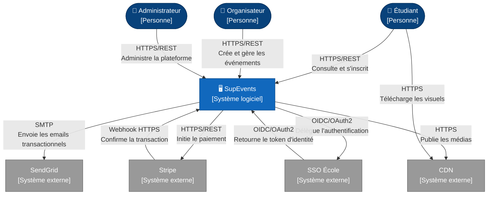
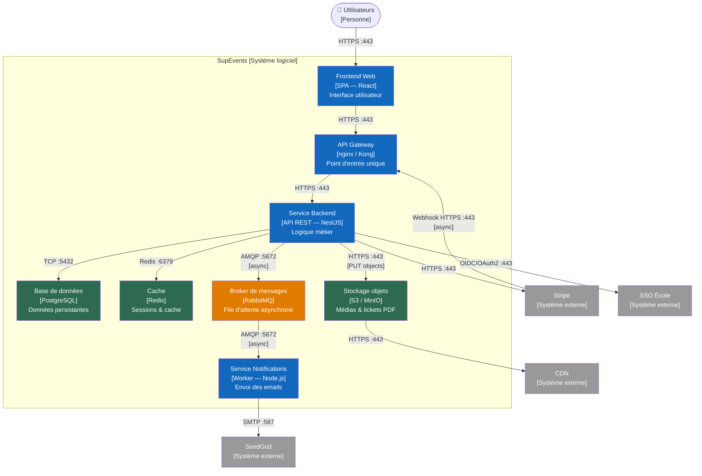
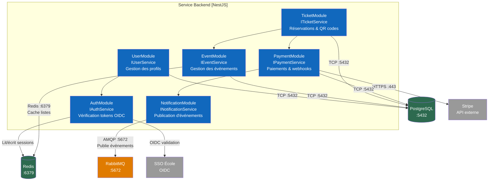
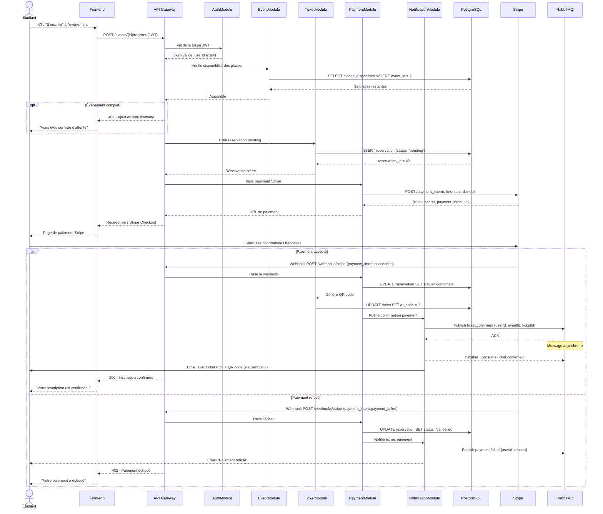
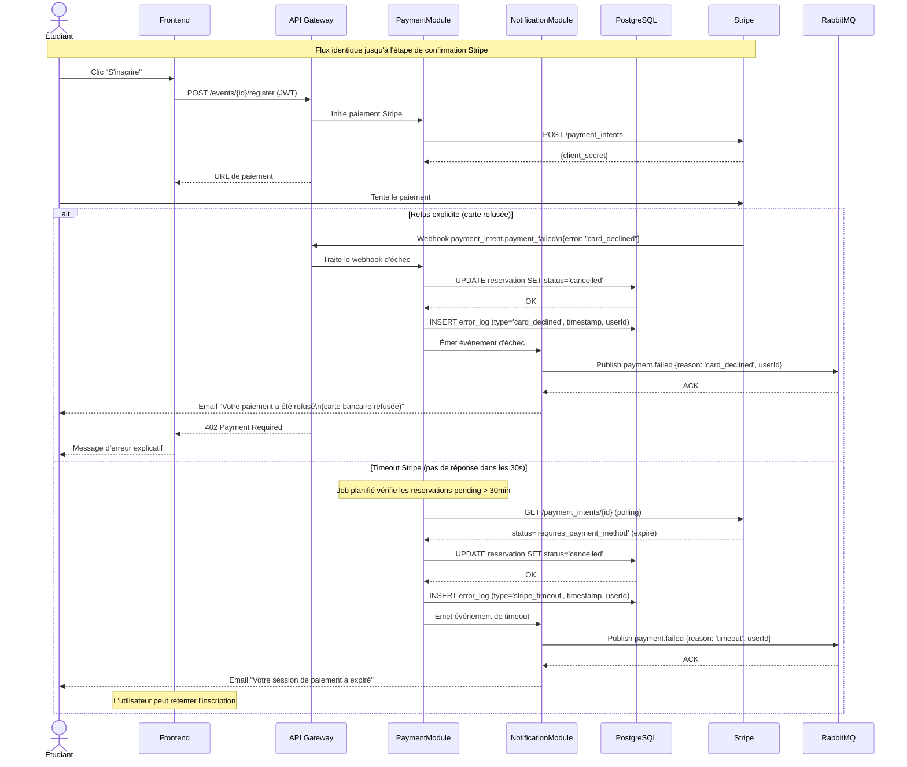

# §6 — Architecture SupEvents

## §6.1 — Vue logique

---

### Diagramme C4 Context

Ce diagramme présente une vue d'ensemble du système SupEvents dans son environnement. Il positionne le système au centre des interactions avec ses utilisateurs humains et les services tiers dont il dépend. Il est destiné à toute l'équipe projet — développeurs, architectes et décideurs métier — afin de partager une vision commune du périmètre applicatif.

Le diagramme met en évidence quatre dépendances externes critiques : Stripe pour la gestion sécurisée des paiements (flux aller-retour via webhook), SendGrid pour les notifications email, le SSO École comme fournisseur d'identité unique (OIDC), et le CDN pour la distribution des médias. Le découplage entre SupEvents et ces systèmes tiers est un choix architectural fort qui limite l'impact en cas de panne d'un fournisseur.

---

### Diagramme C4 Containers

Ce diagramme zoome à l'intérieur du système SupEvents et expose les différents blocs déployables qui le composent, avec leurs technologies respectives. Il est principalement destiné aux développeurs et aux architectes pour comprendre comment les responsabilités sont distribuées entre les containers et quels protocoles sont utilisés pour leur communication.

On notera la séparation nette entre les flux synchrones (HTTPS, TCP, Redis) et les flux asynchrones (AMQP via RabbitMQ). Le broker découple le service Backend du service de notifications : le backend n'a pas besoin d'attendre la confirmation de l'envoi email pour répondre à l'utilisateur. L'API Gateway centralise l'authentification et le routage, ce qui simplifie la logique de sécurité dans le backend.

---

## §6.2 — Vue des processus

---

### Diagramme de composants — API Backend

Ce diagramme décompose l'intérieur du container "Service Backend" en modules fonctionnels NestJS. Il représente les interfaces exposées par chaque module, leurs dépendances internes et leurs connexions aux systèmes tiers. Il est destiné aux développeurs backend pour comprendre les responsabilités de chaque module et éviter les couplages non intentionnels.

Les dépendances sont intentionnellement limitées : `TicketModule` dépend de `EventModule` (vérification des places disponibles) et de `PaymentModule` (initiation du paiement), mais pas directement de `NotificationModule`. C'est `PaymentModule` qui publie dans RabbitMQ via `NotificationModule`, assurant ainsi le découplage entre la logique de paiement et l'envoi des emails. `AuthModule` est transversal et peut être utilisé par tous les modules via un guard NestJS.

---

### Diagramme de séquence — Inscription nominale

Ce diagramme couvre le parcours complet d'un étudiant depuis le clic "S'inscrire" jusqu'à la réception du ticket par email. Il détaille les interactions entre tous les composants du système, en distinguant flux synchrones et asynchrones. Il est destiné aux développeurs pour implémenter et tester le flux de bout en bout.

Le fragment `alt` distingue clairement le chemin nominal (paiement accepté) du chemin d'erreur. Le fragment `opt` gère le cas de la liste d'attente avant même l'initiation du paiement. La confirmation Stripe arrive via webhook (flux asynchrone entrant), ce qui implique que le frontend ne doit pas attendre une réponse synchrone du backend sur cette étape — une contrainte importante pour l'implémentation du polling ou des WebSockets côté client.

---

### Diagramme de séquence — Échec de paiement

Ce diagramme reprend le flux d'inscription jusqu'à l'étape de confirmation Stripe, mais modélise les deux cas d'échec possibles : le timeout (absence de réponse dans les délais) et le refus explicite (carte refusée). Il est destiné aux développeurs et aux équipes de test pour s'assurer que les cas d'erreur sont correctement gérés et tracés.

Les deux cas d'échec aboutissent systématiquement à une libération de la réservation (`status='cancelled'`) et à un log d'incident dans PostgreSQL — garantissant la traçabilité. La distinction principale réside dans le déclencheur : le refus explicite est traité immédiatement via webhook, tandis que le timeout nécessite un job planifié (cron) qui interroge Stripe en polling. La notification à l'étudiant est dans les deux cas différente afin de lui communiquer une raison précise et lui permettre de réagir (retenter, contacter sa banque, etc.).
